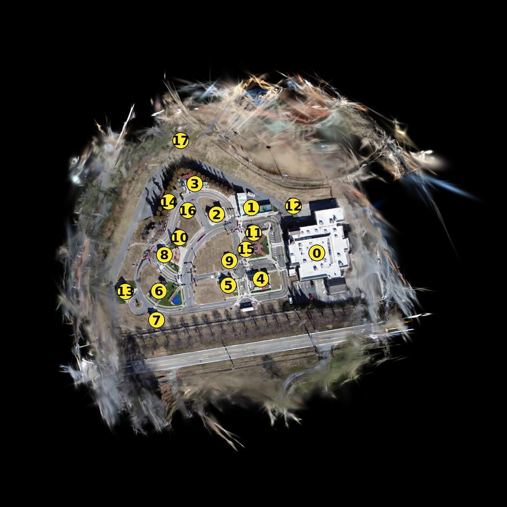
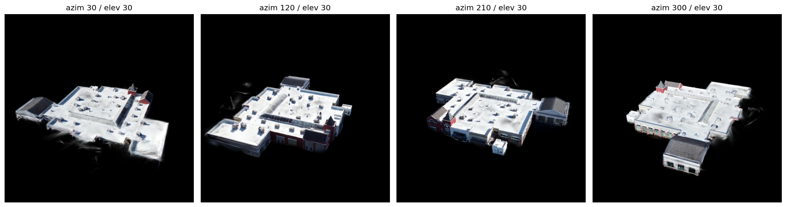
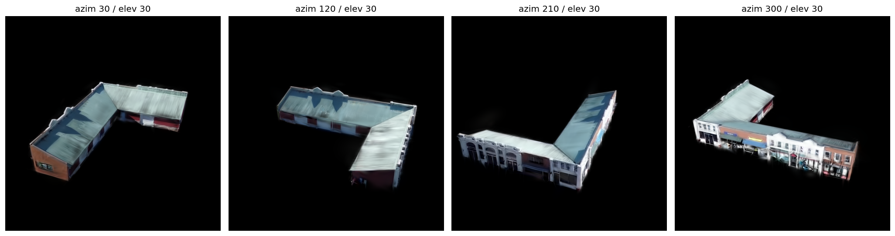

# GeoLangSplat

**Training-free, open-vocabulary 3D segmentation for Gaussian splats.** Give it a text
prompt (`"house"`, `"road"`, `"tree"`, …) and a splat; it returns which Gaussians belong to
that concept — as a segmented `.ply`, a highlight overlay, or a per-Gaussian report. One
engine serves **aerial** (oblique drone), **satellite** (near-nadir), and **object/interior**
(360° inward) captures; the default `auto` recipe reads the scene geometry and synthesizes its
own views, so the common case is `gls segment scene.ply "thing"` with no flags.

<p align="center">
  
</p>
<p align="center">
  
  &nbsp;
  
</p>
<p align="center"><sub><code>gls catalog scene.ply building</code> &nbsp;--&gt;&nbsp; every building becomes its own instance, then lifts out as a <code>.ply</code></sub></p>

---

## How it works

```
text prompt
    |
    v
SAM3 segments each view  -->  alpha-weighted back-projection  -->  per-Gaussian scores
    ^                                                                    |
views of the splat                             competition + cleanup  <--+
(auto-synthesized, or your real photos)                  |
                                                         v
                                   segmented .ply  /  overlay .ply  /  per-Gaussian report
```

- **Training-free.** No per-scene optimization, no CLIP. We run SAM3 over views of the splat
  and lift its per-pixel scores into 3D --> one continuous score per Gaussian. A brand-new
  scene is usable in seconds; quality just tracks SAM3 and the reconstruction.
- **Views are the quality knob.** The model can only label what SAM3 sees. The `auto` recipe
  reads the scene and picks the views for you --> flat/top-down captures get a nadir + oblique
  ladder, rooms and objects get a gravity-up dome. Or point it at the scene's real photos with
  `--view-source images --sfm`.
- **One code path, two speeds.** One-shot (default) streams the lift one chunk at a time
  (encode --> score --> project --> evict), so peak VRAM stays flat no matter how big the scene
  is. Keep an engine warm with `gls serve` and repeat queries come back in ~1-2 s.

---

## Installation

GeoLangSplat runs inside an existing **fVDB** environment (the fvdb monorepo build, with
`torch` + `fvdb-reality-capture`; not on PyPI). It is light --> it adds only `numpy`, `pillow`,
`tyro`, and the `gls` command.

1. **Install into your fVDB env:**

   ```bash
   source /path/to/fvdb-env/bin/activate
   pip install -e .                     # registers the `gls` command
   ```

2. **Add SAM3** — the 2D segmenter used by `segment`/`bake`. It is not on PyPI: install it from
   source so that `import sam3` works. It loads lazily, so it is *not* needed to import the
   package, run the tests (SAM3 is mocked), or run `gls check`.

3. **Point at a checkpoint and run the preflight:**

   ```bash
   export GEOLANGSPLAT_SAM_CKPT=/path/to/sam3.1_multiplex.pt
   gls doctor                           # checks GPU/bf16, fvdb, SAM3, checkpoint
   ```

For a one-shot provision (e.g. baking a lab image), `setup.sh` downloads the checkpoint
(`GEOLANGSPLAT_SAM_URL=...`), installs the package, and runs `gls doctor` so the environment
ships ready — the notebook/first run then needs no installs.

---

## Python / notebook

```python
from geolangsplat import segment, GeoLangSplatConfig

# single prompt -> per-Gaussian selection, written to an overlay .ply
res = segment(
    "scene.ply", "building",
    config=GeoLangSplatConfig(low_vram=True),     # bound VRAM (~6-7 GB)
    output="ply_overlay", out_path="building.ply",
)
print(res.num_selected, "/", res.scores.shape[0])

# multiple prompts -> multi-class labelling (argmax + confidence/ambiguity gates)
res = segment("scene.ply", ["building", "tree", "grass", "road"], recipe="satellite")
res.to_report("labels.csv")          # index,x,y,z,label_id,label,score (+ legend.json)
```

`segment(...)` returns a `SegmentResult` with per-Gaussian `scores`, a boolean `selected`
mask, and (multi-prompt) `label_ids`, all in **input `.ply` order**. Pass a `GaussianSplat3d`
or a path; every `GeoLangSplatConfig` field is settable (explicit fields beat a recipe). Reuse
`GeoLangSplatEngine` to build once and query many times.

### Use as a post-processing step

GeoLangSplat is a **self-contained post-processing stage** over any reconstruction: in goes a
Gaussian splat (a `.ply` or in-memory `fvdb.GaussianSplat3d`, plus an optional COLMAP scene),
out come per-Gaussian labels in input order. With no per-scene training and no required upstream
state, it drops in after a reconstruction step (e.g. fvdb-reality-capture) — consume
`result.selected` / `result.label_ids` directly or persist `to_ply_*` / `to_report`.

Display inline in a notebook without an interactive viewer:

```python
from IPython.display import Image
import subprocess; subprocess.run(["gls", "render", "building.ply", "-o", "building.png"])
Image("building.png")
```

The overlay `.ply` also opens in the `fvdb.viz` viewer (`gls show building.ply`).

### Segment catalog (notebook object database)

`build_catalog` runs a whole vocabulary in one pass and turns the result into a small,
browsable database of individual objects: each prompt is segmented, split into spatial
objects (3D connected components), and objects hit by several prompts (e.g. `car` and
`vehicle`) are merged and given a stable id. The catalog is a table you browse and pull
single objects from — handy for picking a specific segment to export downstream.

```python
from geolangsplat import build_catalog

cat = build_catalog("scene.ply", ["building", "car", "tree", "road"], recipe="satellite")
cat                             # rich HTML table inline (id, label, n_gaussians, size, prompts)
cat.browse()                    # interactive picker: preview + select objects -> export .ply
cat.table                       # the same data as a pandas DataFrame (filter / sort)
cat.show()                      # top-down render with each object's id drawn on it
cat.extract(3, "obj3.ply")      # pull one object out as its own .ply
cat.export_all("scene_catalog/")  # objects/<id>_<label>.ply + catalog.csv + labeled .ply
cat.save("scene_catalog/")      # persist; reload with SegmentCatalog.load(dir, model)
```

`cat.browse()` is the no-id-juggling way to grab segments in a notebook: it shows a live
preview beside a checklist of every object — click objects to highlight them in the render,
then hit **Export selected** to write their `.ply`s. If the catalog was built from a warm
engine, a query box re-runs the vocabulary in place (needs `ipywidgets`). The table is built
from plain row dicts, so swapping pandas for `cudf` (GPU frame) is a one-liner if a lab needs
it. Reuse a warm `GeoLangSplatEngine` (`engine.catalog(vocab)`) to build several catalogs of
the same scene without re-baking.

---

## CLI

```bash
gls segment scene.ply "road" -O ply_overlay -o road.ply   # auto recipe, synthesized views
gls bake    scene.ply --vocab house tree grass road -o labels/   # fixed-vocab multi-class
gls catalog scene.ply --vocab building car tree road -o catalog/  # ID'd per-object .ply database
gls check   scene.ply                                     # readiness + detected capture
gls render  out.ply -o out.png                            # montage PNG (good over SSH)
gls show    out.ply                                       # 3D viewer (fvdb.viz)
```

### Flags

Shared (`segment`/`bake`/`check`/`serve`): `-r/--recipe auto|satellite|satellite_dense|aerial`
(default `auto`; `aerial` segments **real photos** and needs `-s/--sfm /path/scene`) ·
`--view-source render|globe|images` · `-u/--up auto|+z|-z|+y|-y|+x|-x` · `--max-views N` ·
`--vram-budget-gb G` · `-d/--device`.

`segment` query: `-O/--output mask|ply_segmented|ply_overlay|report` · `-o/--out-path` ·
`-t/--select <thresh>` (the main knob) · `--peak <0..1>` · `--compete` (suppress near-synonyms) ·
`--inside-out` (interior scenes) · `--profile`.

VRAM / streaming: `--low-vram`/`--no-low-vram` · `--stream-chunk N` (time↔VRAM) ·
`--stream-early-stop auto|on|off` · `--cache-dtype auto|amp|fp16|bf16`.

Other commands: `render` adds `-n/--n-views`, `-z/--zoom` (<1 pulls in, >1 backs out),
`--globe/--no-globe`; `serve` adds `-b/--background`, `--fast-views N`; `bake` and `catalog`
take `--vocab w1 w2 …` (or `--vocab-file`), and `catalog` adds `--iou <0..1>` (cross-prompt
merge threshold) and `-o/--out` (output folder). Bash completion:
`echo "source $(pwd)/completions/gls.bash" >> ~/.bashrc`.

### Execution modes

One-shot (default) builds, answers, and exits with bounded VRAM:

```bash
gls segment scene.ply "building" -O ply_overlay -o b.ply
```

Memory-bound? Lower `--stream-chunk`, drop `lift_res`, or pick a recipe with fewer views.

Keep an engine warm for rapid repeated queries:

```bash
gls serve   scene.ply -r satellite -b      # build once, detach
gls segment scene.ply "building" -o b.ply  # instant (auto-attaches)
gls status                                 # what's running
gls stop    scene.ply                      # free it (or `gls stop` = all)
```

You only ever type `gls segment`; building-and-exiting vs attaching to a running engine is
automatic. Once an engine is up, build flags (`-r`, `-s`) are ignored; query flags (`-t`,
`--compete`, `-O`/`-o`) apply. The engine always releases the GPU (idle timeout, `gls stop`,
Ctrl-C, or crash).

**Concept competition** (`--compete` / `config.compete`): a Gaussian is kept only if it beats
the best distractor prompt by `margin` (stops a query bleeding into near-synonyms — e.g.
`building` leaking onto an empty pool that reads as `water`). Works in both execution modes;
`bake` competes implicitly via argmax.

**Dual-head fusion** (`config.dual_head`, off by default): SAM3 hands back two maps from one
pass --> an *instance* head for countable "things" (cars, buildings) and a *semantic* head for
"stuff" (ground, road, vegetation). The instance head drops anything it isn't sure is an
object, so amorphous classes can come back empty --> blending the semantic map back in recovers
them at no extra cost. Still training-free. On indoor/object scenes, `dual_head=True,
sem_weight=0.5` works best.

---

## Scene quality

Results depend on the reconstruction — the method can only label Gaussians the views observe.
Check readiness first (geometry only, no SAM3 weights):

```bash
gls check scene.ply -r satellite      # coverage, views/gaussian, verdict: good|fair|poor
```

```python
from geolangsplat import assess_scene
assess_scene(model, recipe="satellite")   # same dict the CLI prints
```

A `poor` verdict usually means: raise the view count, use a closer/denser recipe, switch
`view_source`, or improve the reconstruction. If a clearly-visible object returns 0 Gaussians,
it is usually wording — try a synonym (`"oven mitt"` vs `"mitten"`).

---

## Where this fits

GeoLangSplat is a post-processing step for `fvdb-reality-capture`: reconstruct a scene -->
hand the splat to GeoLangSplat --> get per-Gaussian labels back. There is no per-scene training
and nothing to wire up beforehand, so it drops in right after reconstruction alongside the
other post-processing tools (mesh, points, evaluation). The bundled `viewer/` powers the
optional `gls explore` UI for live prompt tuning and catalog browsing; the stable surface is
`gls segment` / `gls catalog` and the `segment` / `build_catalog` APIs.

---

## Tests & layout

```bash
pip install -e ".[test]" && pytest tests/   # 120 tests, CPU-only, SAM 3 / fVDB mocked, no GPU
```

```
geolangsplat/
  config.py     # GeoLangSplatConfig + recipes (auto/satellite/.../aerial)
  autoview.py   # geometry -> view plan: capture detect, up-axis RANSAC, dome rings, framing
  cameras.py    # intrinsics, orbit / look-at / inside-out cameras
  views.py      # view generation: synthesized render | dome | real photos (--sfm)
  sam3.py       # SAM3 encode + promptable scoremap
  lift.py       # alpha-weighted back-projection + low-VRAM streaming lift
  select.py     # selection, competition, cleanup, multi-class labels
  instances.py  # split a selection into spatial objects (3D connected components)
  catalog.py    # multi-prompt object catalog: cluster + ID + per-object .ply (notebook db)
  engine.py     # build-once / query-many engine (one-shot streaming + warm modes)
  api.py        # segment() / build_catalog() -> the public surface
  outputs.py    # ply / report writers
  cli/          # segment|bake|catalog|check|doctor|serve|status|stop|show|render|explore
  viewer/       # web query UI that backs `gls explore` (optional)
```

---

## Scope & scale

GeoLangSplat is a **reference implementation**, not a distributed engine: it shows the
training-free path end-to-end on a single GPU, clearly enough to lift and scale.

- **Single GPU, single process** --> no multi-GPU sharding or multi-node; the build encodes
  every view's SAM 3 features and lifts them on one device.
- **VRAM-bound, not out-of-core** --> per-view features + per-Gaussian scores live in device
  memory; `--low-vram` streaming caps peak to ~one view, but there is no spatial tiling, so a
  city-scale splat (tens of millions of Gaussians / hundreds of views) will not fit.
- **Auto-view targets one coherent capture** --> the synthesized orbit/ladder/dome is fit to a
  single site or block; a large spread-out mosaic under-samples unless you grow the view count
  (and with it build time + VRAM).

Best fit: a park, a few blocks, an object, or an interior. Tested on **SafetyPark** (oblique
drone) and the **JAX_\*** WorldView-3 satellite scenes; the object/interior recipes were
exercised on Mip-NeRF 360 and LERF-OVS captures.

---

## References

**Methods & models**

- **SAM 3** — the promptable 2D segmenter GeoLangSplat runs over views of the splat (Meta; not on PyPI): https://github.com/facebookresearch/sam3
- **LangSplat / LangSplatV2** — the open-vocabulary language-field lineage this builds on; see the sibling [`langsplatv2/`](../langsplatv2) example (Qin et al., CVPR 2024).
- **CLIP** — the vision-language backbone behind most open-vocabulary segmentation; GeoLangSplat skips the per-scene CLIP field and prompts SAM 3 directly (Radford et al., 2021): https://github.com/openai/CLIP
- **SegEarth-OV / SegEarth-OV3** — related training-free open-vocabulary segmentation for remote sensing imagery (Li et al., CVPR 2025): https://github.com/earth-insights/SegEarth-OV-3
- **fVDB** — the 3D representation, rendering, and alpha-weighted back-projection that lifts 2D scores to per-Gaussian labels: https://github.com/openvdb/fvdb-core

**Datasets**

- **US3D / DFC2019** — WorldView-3 satellite imagery over Jacksonville (the `JAX_*` scenes), from the 2019 IEEE GRSS Data Fusion Contest; imagery courtesy of Maxar/DigitalGlobe (Bosch et al., WACV 2019, arXiv:1811.08739): https://ieee-dataport.org/open-access/data-fusion-contest-2019-dfc2019
- **Mip-NeRF 360** and **LERF-OVS** — ground/object 360 captures used to exercise the globe / inside-out recipes.
